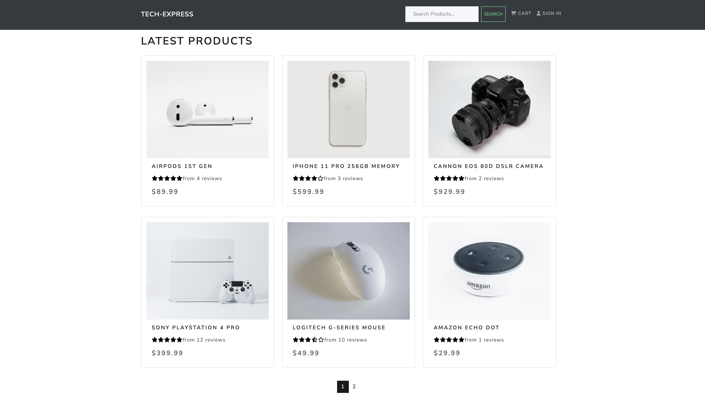

# TechExpress

> An eCommerce web app built with the MERN Stack (MongoDB, Express, React, and Node.JS), Redux, RTK-Query, and React-Bootstrap.

> Live Demo: https://tech-express.onrender.com



<!-- toc -->

- [Features](#features)
- [Usage](#usage)
  - [Env Variables](#env-variables)
  - [Install Dependencies (frontend & backend)](#install-dependencies-frontend--backend)
  - [Run](#run)
- [Build & Deploy](#build--deploy)
  - [Seed Database](#seed-database)
- [Sources](#sources)
- [Credit](#credit)

<!-- tocstop -->

## Features

- Full featured shopping cart
- Product reviews and ratings
- Product pagination
- Product search feature
- User profile with orders
- Admin product management
- Admin user management
- Admin Order details page
- Mark orders as delivered option
- Checkout process (shipping, payment method, etc)
- PayPal / credit card integration
- Database seeder (products & users)

## Usage

- Create a MongoDB database and obtain your `MongoDB URI` - [MongoDB Atlas](https://www.mongodb.com/cloud/atlas/register)
- Create a PayPal account and obtain your `Client ID` - [PayPal Developer](https://developer.paypal.com/)

### Env Variables

Create a `.env` file in the root directory and add the following to it

```
NODE_ENV = development
PORT = 5000
MONGO_URI = your_mongodb_uri
JWT_SECRET = 'abc123'
PAYPAL_CLIENT_ID = your_paypal_client_id
```

Change the JWT_SECRET to what you want

### Install Dependencies (frontend & backend)

```
npm install
cd frontend
npm install
```

### Run

```
# Run frontend and backend
npm run dev
# Run backend only
npm run server
```

## Build & Deploy

```
# Create frontend prod build
cd frontend
npm run build
```

### Seed Database

You can use the following commands to seed the database with some sample users and products as well as destroy all data

```
# Import data
npm run data:import
```

```
# Destroy data
npm run data:destroy
```

## Sources

- React Docs: https://react.dev/
- React-Bootstrap: https://react-bootstrap.netlify.app/
- React-Redux: https://react-redux.js.org/

## Credit

Copyright © Mohamed Abdulwahab 2023
